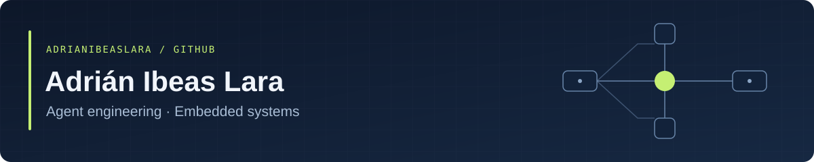

I'm building a public learning lab around **agent engineering**: clear technical questions, documented decisions, and reproducible experiments as the project develops. I completed the **Zrive Applied Data Science program in 2024**, and my earlier work includes **embedded systems in C**.

### Selected projects

**[Zrive Applied Data Science — Coursework](https://github.com/adrianibeaslara/zrive-applied-data-science)**  
My 2024 coursework, preserved in five module branches with an index to navigate the exercises.

- **Topics:** exploratory analysis, classification, baselines, preprocessing, model diagnostics, and feature importance.
- **Provenance:** a copy of my original public coursework, retaining the Zrive framework attribution and GPLv3 license.

**[Agent Engineering Lab](https://github.com/adrianibeaslara/agent-engineering-lab)**  
A place to turn learning into technical notes, justified decisions, and experiments that can be inspected and reproduced.

- **Current stage:** repository foundation and methodology. The first experiment has yet to be selected.
- **Planned tooling:** Python, uv, Ruff, and Pytest; introduced when the first code requires them.

**[Automated Parking System](https://github.com/adrianibeaslara/Design-of-an-Automated-Vehicle-Parking-System-Using-a-Microcontroller)**  
My completed 2023–2024 bachelor thesis: a physical six-space parking prototype built with STM32L-DISCOVERY and NUCLEO-L152RE boards.

- **In the source:** STM32 HAL, GPIO interrupts, timers/PWM, ultrasonic distance measurement, and an I²C LCD.
- **Project evidence:** original prototype photos, pin maps, software flowcharts, and thesis-reported demonstrations. [See the prototype gallery](https://github.com/adrianibeaslara/Design-of-an-Automated-Vehicle-Parking-System-Using-a-Microcontroller/blob/main/docs/gallery.md).
- **Published scope:** application sources and a host LCD check; the complete Cube build project and checked electrical schematics remain to be recovered.

### Current focus

- Agent system design, evaluation, and reliability.
- Comparing technical choices through baselines, useful metrics, and failure analysis.
- Making projects easy to understand, inspect, and reproduce.

---

[Explore the agent lab →](https://github.com/adrianibeaslara/agent-engineering-lab)
