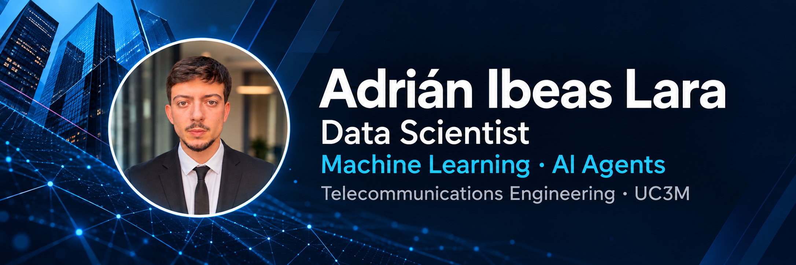

I'm a **Data Scientist** with a **Telecommunications Engineering** background from **UC3M**, focused on building **machine learning and AI systems that run in production**.

My work spans the ML lifecycle: data, modeling, deployment, monitoring and retraining. I also build **LLM-powered agents with LangGraph**. Here you'll find my public projects, applied data science coursework and agent engineering lab.

[LinkedIn](https://www.linkedin.com/in/adrian-ibeas-lara-332969212) · [Public repositories](https://github.com/adrianibeaslara?tab=repositories)

### Technologies & languages

| Area | Stack |
| --- | --- |
| Languages | **Python** · **SQL** · C (embedded systems) |
| Machine learning & data | PySpark · XGBoost · LightGBM · Optuna · NetworkX |
| AI agents | **LangGraph** · LangChain |
| MLOps & tooling | ZenML · Git |
| Cloud & platforms | AWS — EMR, Bedrock, S3 · Databricks |

### Selected projects

| Project | What you'll find |
| --- | --- |
| [Agent Engineering Lab](https://github.com/adrianibeaslara/agent-engineering-lab) | A public lab in development for agent design, evaluation and documented technical decisions. |
| [Zrive Applied Data Science](https://github.com/adrianibeaslara/zrive-applied-data-science) | My 2024 coursework: exploratory analysis, modeling and diagnostics, organized across five module branches. |
| [Automated Parking System](https://github.com/adrianibeaslara/Design-of-an-Automated-Vehicle-Parking-System-Using-a-Microcontroller) | My completed bachelor thesis: a six-space STM32 prototype, C firmware, original photographs and technical documentation. |
